# wk7-nacos-sentinel
https://www.fangzhipeng.com/spring-cloud.html

Set up Spring Cloud Alibaba, integrating nacos and sentinel with Sprig Boot Admin, as followed by the Fig.1 below.

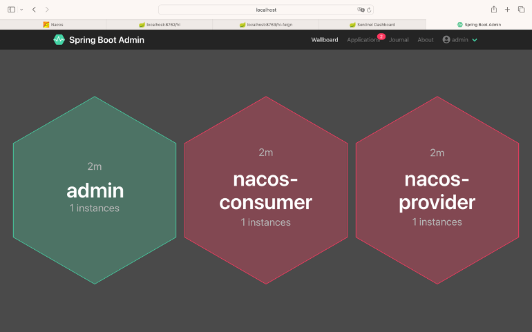
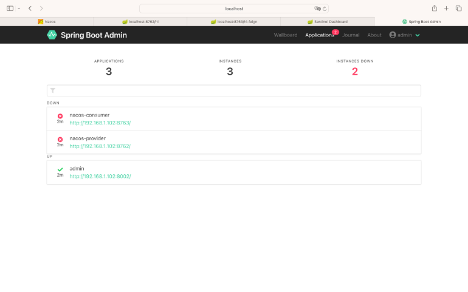
<p style="margin: 0;">Fig.1 Nacos-Sentinel</p>

## Nacos

**Step1**, 

```sh
cd nacos/bin
```

```sh
sh startup.sh -m standalone
```

```sh
http://localhost:8848/nacos/
```

username: nacos, password: nacos, as followed by the Fig.2 below.
<div style="text-align: center;">
    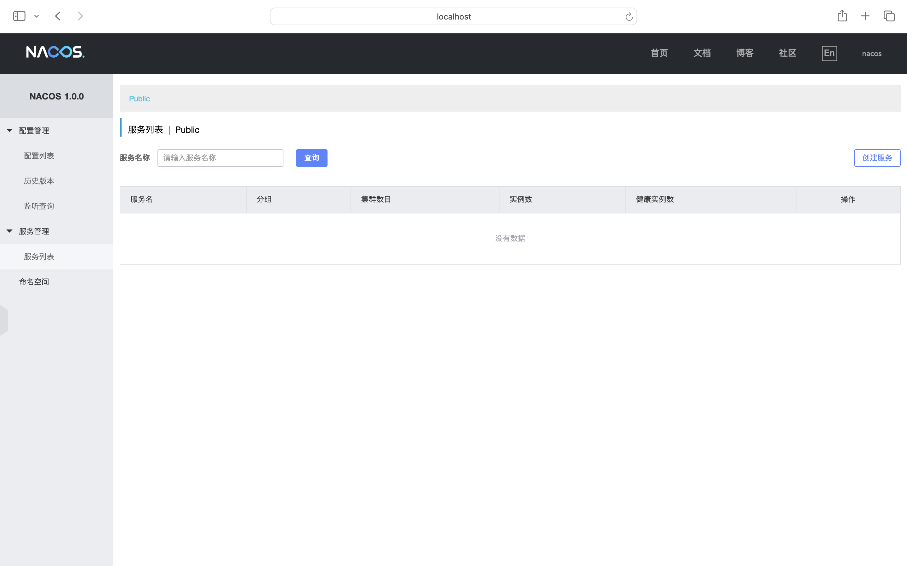
    <p style="margin: 0;">Fig.2 Nacos</p>
</div>

**Step2**, run NacosProviderApplication.java, NacosCustomerApplication.java, as followed by the Fig.3-4.

<div style="text-align: center;">
    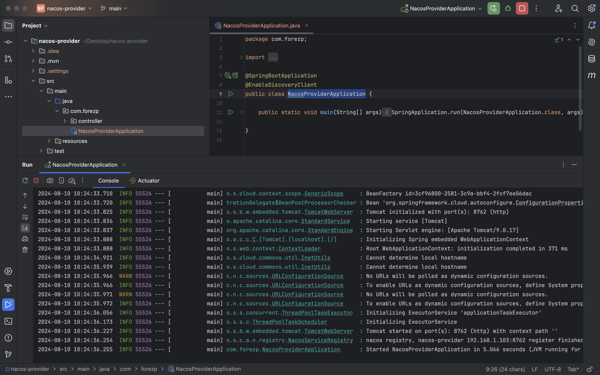
    <p style="margin: 0;">Fig.3 Nacos-Provider</p>
</div>
<div style="text-align: center;">
    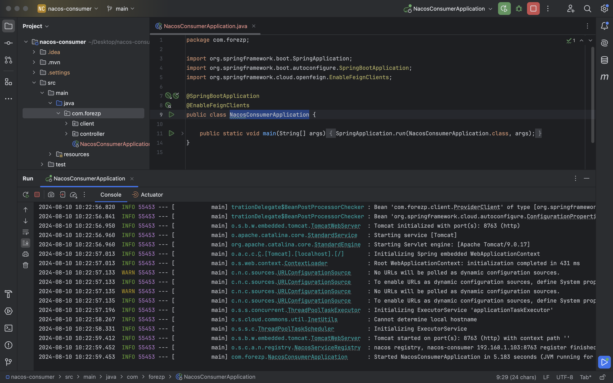
    <p style="margin: 0;">Fig.4 Nacos-Consumer</p>
</div>

**Step3**, click column "Service List", indicating the successful configuration of Nacos, as followed by the Fig.5 below.

<div style="text-align: center;">
    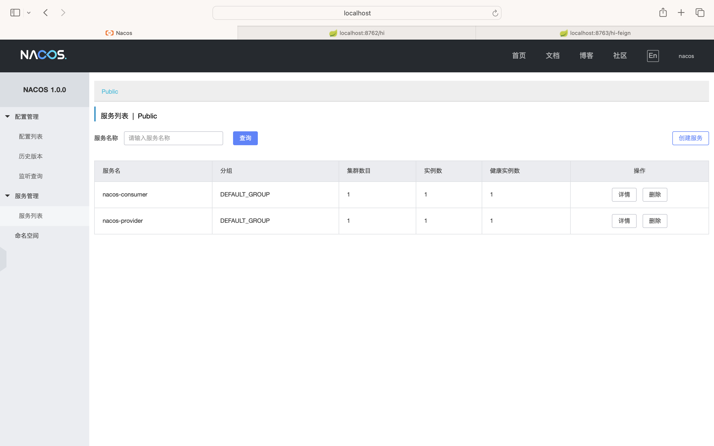
    <p style="margin: 0;">Fig.5 Nacos</p>
</div>

## Sentinel

**Step1**, download sentinel dashboard and start by:

```sh
java -jar sentinel-dashboard-1.6.1.jar
```

The default startup port is 8080 (change by 'java -jar sentinel-dashboard-1.6.1.jar -Dserver.port=8081'). Then visit http://localhost:8080/ to display the Sentinel page (username: sentinel, password: sentinel).
- Sentinel Dashboard ([Download for Mac](https://github.com/alibaba/Sentinel/releases/download/1.6.1/sentinel-dashboard-1.6.1.jar))

**Step2**, cd sentinel, then run NacosProviderApplication.java, NacosCustomerApplication.java

**Step3**, multiple times visit http://localhost:8762/hi of nacos-provider then check sentinel dashboard (Fig.6). Check the interface resource info (Fig.7). Click "Add Flow Control" to configure (Fig.8) the functionality of flow control for the /hi resource.

**Step4**, test. Multiple times visit http://localhost:8762/hi of nacos-provider, and you can find the following info "Blocked by Sentinel (flow limiting)" with the normal return logic being "hi forezp", which indicates the functionality of flow control works (Fig.9). Then check sentinel dashboard (Fig.10).

<div style="text-align: center;">
    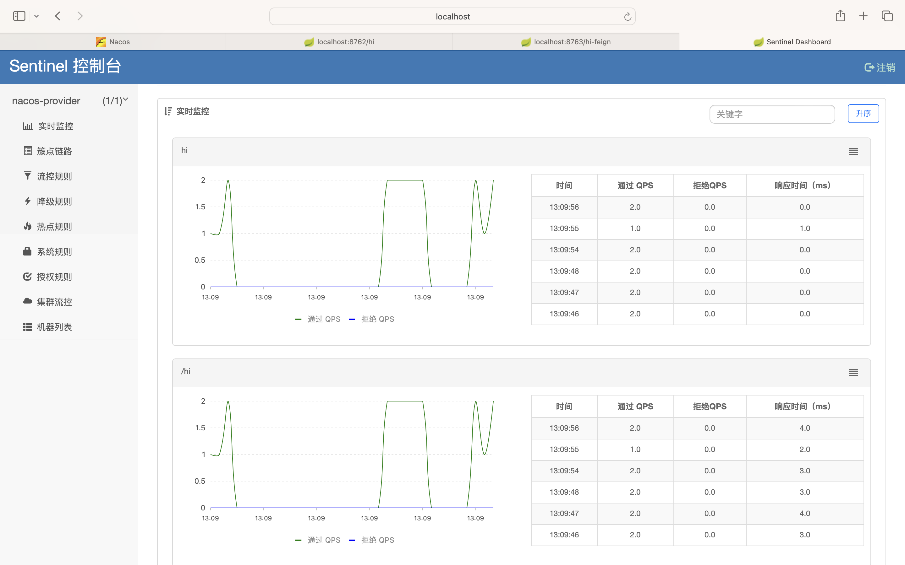
    <p style="margin: 0;">Fig.6 Sentinel-Provider(Dashboard)</p>
</div>
<div style="text-align: center;">
    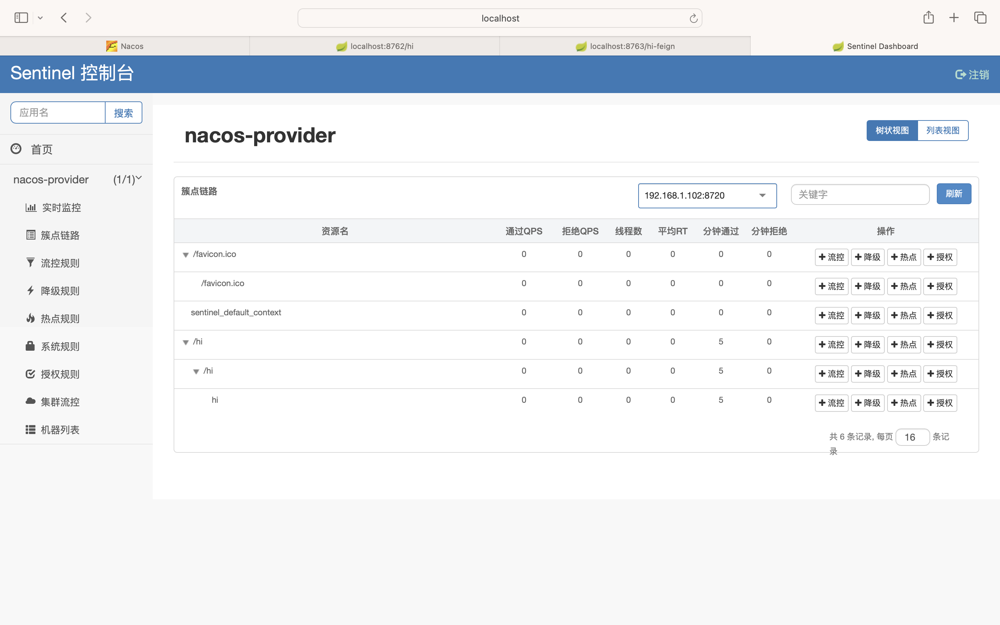
    <p style="margin: 0;">Fig.7 Sentinel-Provider(Resource)</p>
</div>
<div style="text-align: center;">
    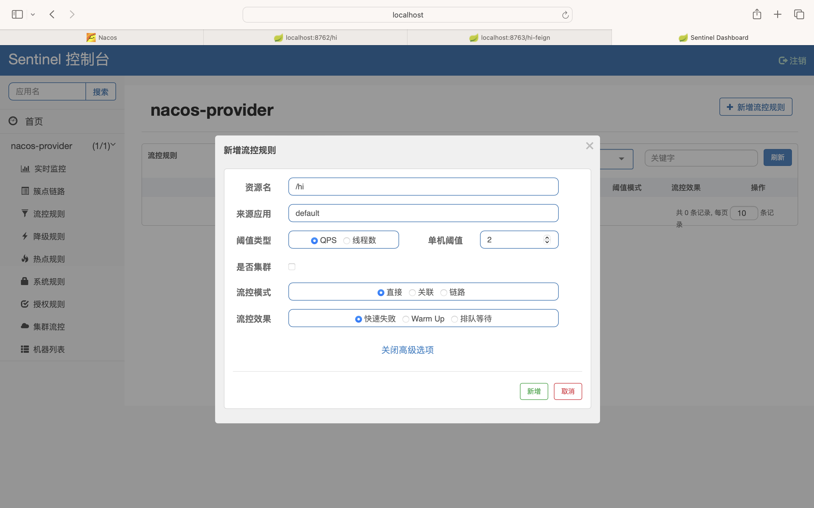
    <p style="margin: 0;">Fig.8 Sentinel-Provider(Limit)</p>
</div>
<div style="text-align: center;">
    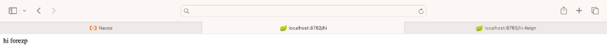
    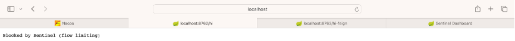
    <p style="margin: 0;">Fig.9 Sentinel-Provider(Limit Result)</p>
</div>
<div style="text-align: center;">
    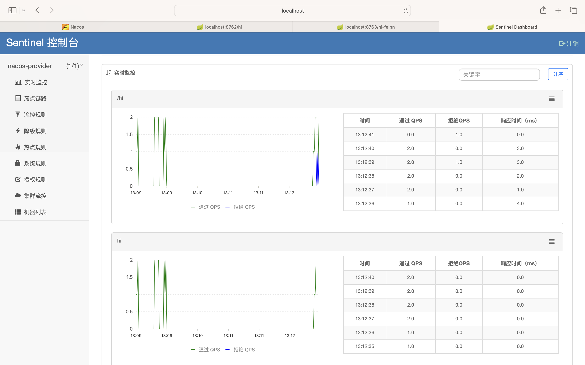
    <p style="margin: 0;">Fig.10 Sentinel-Provider(Renewed Dashboard)</p>
</div>

**Step5**, multiple times visit http://localhost:8763/hi-feign of nacos-consumer then check sentinel dashboard (Fig.11). Check the interface resource info (Fig.12). Click "Add Flow Control" the same way as in nacos-provider to configure the functionality of flow control for the /hi-feign resource.

**Step6**, test. Multiple times visit http://localhost:8763/hi-feign of nacos-consumer, and you can find the following info "Blocked by Sentinel (flow limiting)" with the normal return logic being "hi feign", which indicates the functionality of flow control works (Fig.13). Then check sentinel dashboard (Fig.14).

<div style="text-align: center;">
    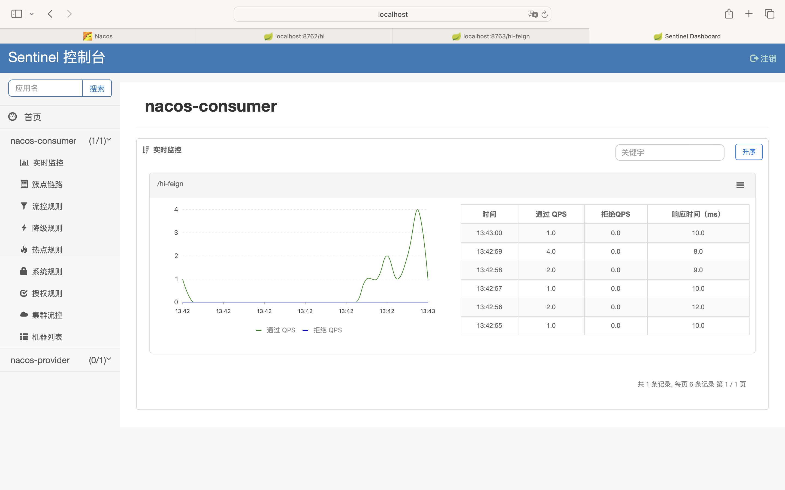
    <p style="margin: 0;">Fig.11 Sentinel-Consumer(Dashboard)</p>
</div>
<div style="text-align: center;">
    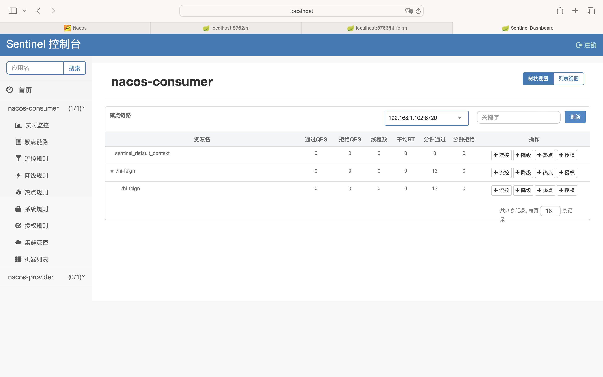
    <p style="margin: 0;">Fig.12 Sentinel-Consumer(Resource)</p>
</div>
<div style="text-align: center;">
    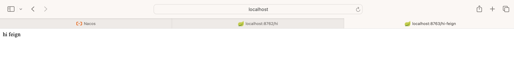
    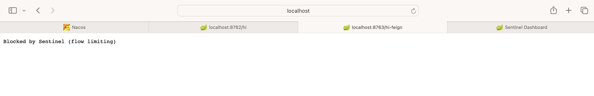
    <p style="margin: 0;">Fig.13 Sentinel-Consumer(Limit Result)</p>
</div>
<div style="text-align: center;">
    
    <p style="margin: 0;">Fig.14 Sentinel-Consumer(Renewed Dashboard)</p>
</div>

